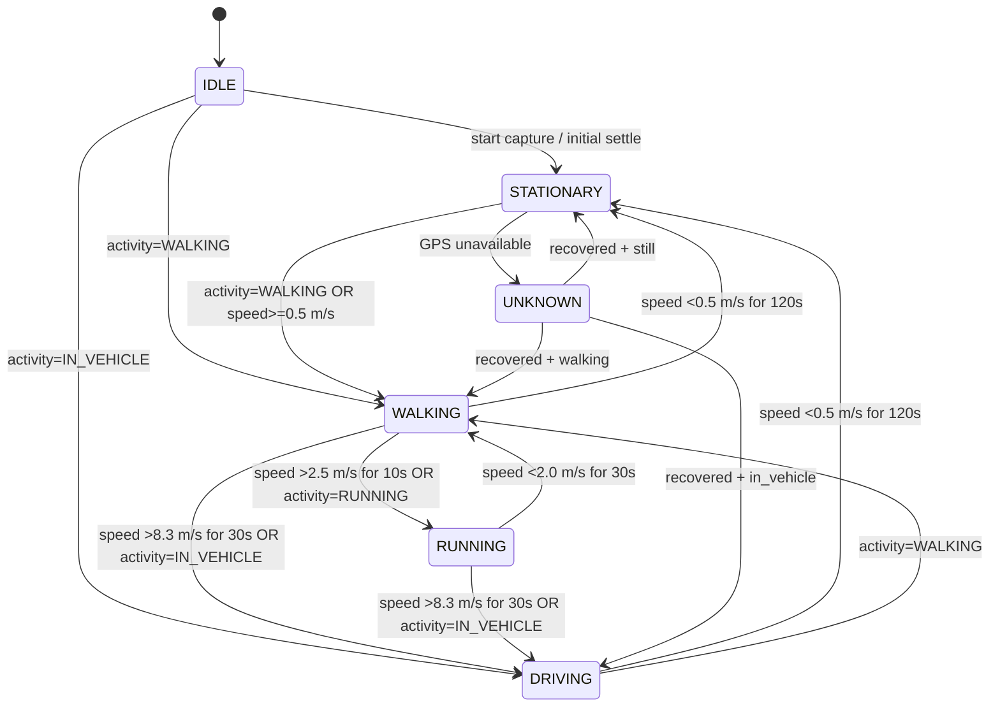
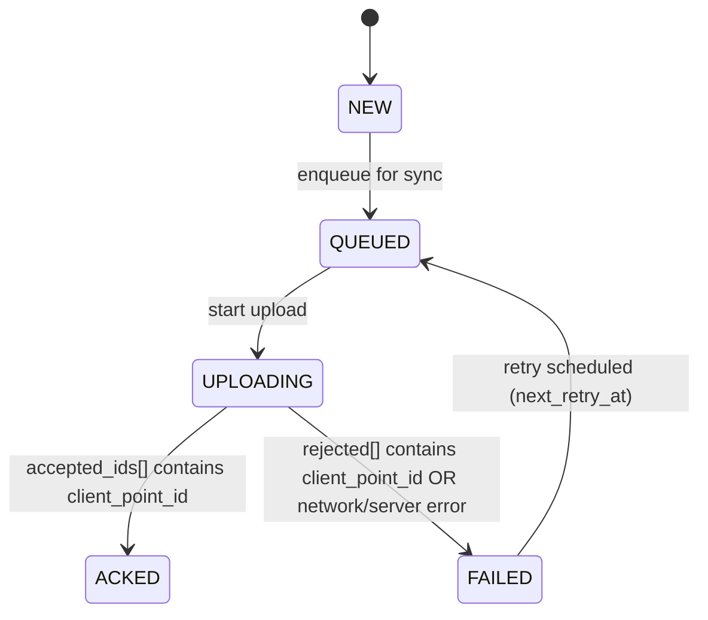
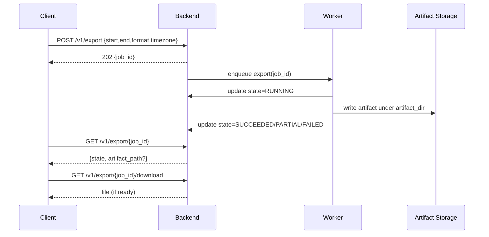
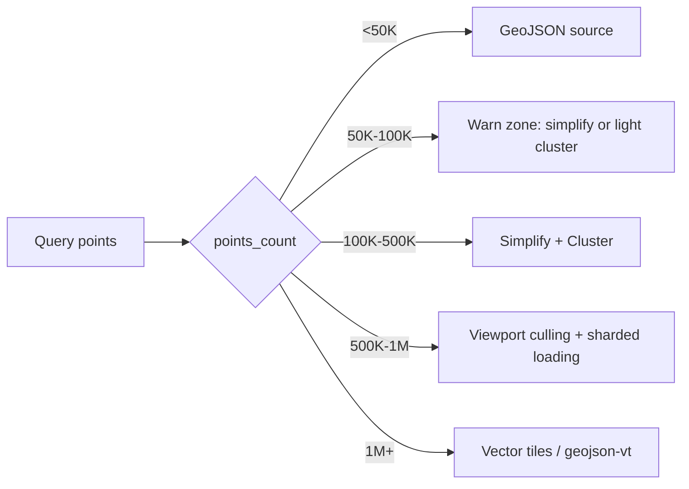
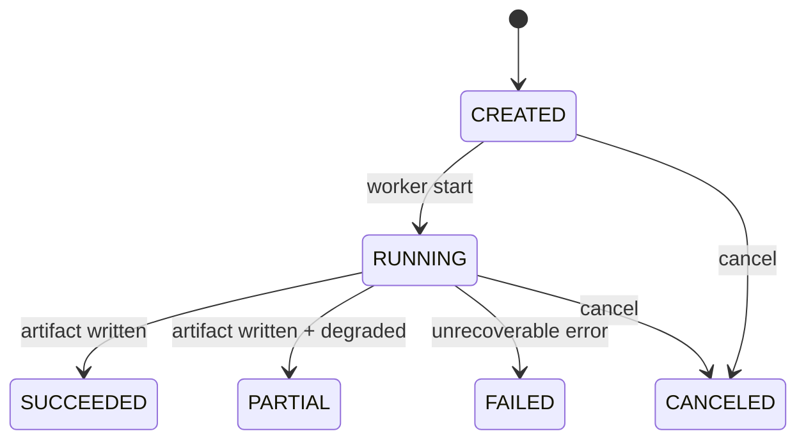

# Wayfarer 设计补充文档（Plan Supplement / Executable Spec）

本文档用于补齐 `plan.md` 中“可实现但未定稿”的设计缺口，并提供可计数/可验收的固定结构（便于 PowerShell 自动校验）。

规范优先级（强制）：当本补充文档与 `plan.md` 描述不一致时，以本补充文档为准；但不得修改 `plan.md`。

参数与阈值来源（强制）：除非明确标注为“设计默认值，可调”，否则所有数值必须引用本地研究文件：
- `.sisyphus/plans/wayfarer-research-notes.md`
- `.sisyphus/plans/wayfarer-plan-supplement.md`（其中的 `Reference Sources & Parameter Baselines` 章节）

版本号规则（强制）：软件版本严格遵循 SemVer 且在用户明确发布 v1.0.0 前，主版本号保持为 0（0.x.y）。`plan.md` 中的 “Version 1.0.0” 仅视为文档版本。

### 全局格式与验收规则（MANDATORY）

1) 每个章节必须包含三个固定子结构（后续任务会逐章填充细节）：
   - Parameters（参数表）
   - Pseudocode / Diagram（伪代码 / Mermaid 图）
   - Boundary Tests（边界测试矩阵）

2) 固定可计数字段（用于 PowerShell `Select-String` 计数）：
   - Gap Inventory 行：`| GAP-### | ... |`
   - Spec Delta 行：`| DELTA-### | ... |`
   - 错误码条目：`- ERR-###: CODE_NAME (HTTP xxx)`
   - 边界测试条目：`- TEST-<DOMAIN>-###: ...`

3) Fixed Tokens（必须逐字出现，区分大小写）：
   - `recorded_at(UTC)`
   - `GPS-only`
   - `life_event_recompute_on_edit: false`
   - `pagination: limit_offset`
   - `cookie_refresh_name: wf_refresh`
   - `cookie_csrf_name: wf_csrf`
   - `dev_cookie_secure: false`
   - `cors_allow_origin: http://localhost:3000`
   - `cors_allow_credentials: true`
   - `frontend_credentials: include`

---

## Gap Inventory

| gap_id | plan_md_ref | gap_desc | target_section | verification |
|---|---|---|---|---|
| GAP-001 | plan.md:117 | Android FSM 仅有标题，无状态集合/采样参数/转换条件/离线退化定义 | ## Android FSM | `Select-String` 命中 `stateDiagram-v2` + 参数表字段（state/interval/minDistance） |
| GAP-002 | plan.md:195 | FSM 的采样频率切换实现缺少“转换优先级（Activity vs speed 推断）”与去抖（debounce）口径 | ## Android FSM | `Select-String` 命中 `GPS-only` + `debounce` |
| GAP-003 | plan.md:31 | Room 本地表结构缺失（track_points_local / life_events_local / sync_queue） | ## Room Schema & Sync | `Select-String` 命中 `CREATE TABLE` 与表名 |
| GAP-004 | plan.md:119 | Sync Engine 仅描述“每次 100 条 + GZIP JSON”，缺少 sync_status 状态机与重试/退避策略 | ## Room Schema & Sync | `Select-String` 命中 `sync_status` 与状态枚举 |
| GAP-005 | plan.md:124 | 冲突解决仅用 recorded_at，缺少幂等主键与“部分成功回执（per-item ack）”语义 | ## Room Schema & Sync | `Select-String` 命中 `client_point_id` + `accepted_ids[]` + `rejected[]` |
| GAP-006 | plan.md:130 | POST /v1/tracks/batch 未定义响应体（accepted/rejected）与幂等重复提交语义 | ## API 规范 | `Select-String` 命中 `POST /v1/tracks/batch` + `accepted_ids[]` |
| GAP-007 | plan.md:144 | 导出接口描述为同步 GET 直出，但风险章节要求导出必须异步（存在冲突） | ## Export Job Lifecycle | `Select-String` 命中 `202` + job 状态图 |
| GAP-008 | plan.md:91 | weather_cache 仅有键描述，缺少 Rate Limit、退避、失败降级（允许无天气导出） | ## Weather Enrichment & Cache | `Select-String` 命中 `600/min` + `geohash_precision: 5` |
| GAP-009 | plan.md:134 | 反作弊仅说明会计算异常并置 is_dirty，缺少速度/步幅阈值与综合判定规则 | ## Anti-Cheat | `Select-String` 命中 `步幅` + `0.5–2.5 m/s` |
| GAP-010 | plan.md:77 | LifeEvent 仅有表结构，缺少 stay point / home-work / commute 的算法与参数 | ## LifeEvent | `Select-String` 命中 `distance_threshold: 200m` + `night hours: 21:00–07:00` |
| GAP-011 | plan.md:1 | 认证机制未定稿（JWT/refresh/cookie/CSRF/CORS 合同缺失） | ## API 规范 | `Select-String` 命中 `cookie_refresh_name: wf_refresh` + `X-CSRF-Token` |
| GAP-012 | plan.md:40 | Web Mapbox 仅选型，无大规模点位渲染的阈值分档与优化策略 | ## Web Map Performance | `Select-String` 命中 `<50K` + `1M+` |

---

## Spec Delta

| delta_id | plan_md_ref | supplement_section | change_type | impact | notes |
|---|---|---|---|---|---|
| DELTA-001 | plan.md:58 | ## Room Schema & Sync | 新增 | DB/API/Android | 增加 `client_point_id`（客户端生成 UUID）并作为服务端幂等唯一键：UNIQUE(user_id, client_point_id)。 |
| DELTA-002 | plan.md:144 | ## Export Job Lifecycle | 澄清 | API/Web/Export | 保留 `GET /v1/export?...` 的“同步/流式”体验，同时引入 Job：include_weather=true 或大数据量时返回 202 + job_id。 |
| DELTA-003 | plan.md:49 | ## API 规范 | 新增 | DB/API/Web | 认证落地采用 JWT access/refresh + refresh_tokens 表（rotation + reuse detection）；Web 使用 cookie+CSRF，Android 使用 body refresh。 |
| DELTA-004 | plan.md:119 | ## Room Schema & Sync | 修订 | API/Android | Sync 回执语义定稿：batch 返回 `accepted_ids[]`/`rejected[]`，重复 client_point_id 视为幂等成功进入 accepted，避免重试风暴。 |
| DELTA-005 | plan.md:4 | ## API 规范 | 澄清 | Release/Docs | 软件版本 SemVer 主版本保持 0；`plan.md` 的 “Version 1.0.0” 仅为文档版本，不代表软件 v1.0.0。 |

---

## Android FSM

### Parameters

来源：`.sisyphus/plans/wayfarer-research-notes.md` 的 `Android FSM（智能采样）`。

| item | value | notes |
|---|---|---|
| state_set | IDLE/STATIONARY/WALKING/RUNNING/CYCLING/DRIVING/UNKNOWN | Design Default，可调 |
| priority_mapping | PASSIVE/LOW_POWER/BALANCED_POWER/HIGH_ACCURACY | Design Default，可调；优先省电，必要时提升精度 |
| decision_priority_rule | Activity Recognition > GPS speed inference; if permission denied then `GPS-only` | 强制：AR 可信度高于 speed 推断；无权限则 GPS-only |
| debounce_window | debounce: 3–5s | Design Default，可调；避免短暂抖动导致频繁切换 |
| offline_degrade | continue local capture; sync later | 离线不停止采集（无网也继续写入 Room，本地缓冲） |
| capability_degrade | Activity Recognition denied → `GPS-only` inference | 仅用 speed/accuracy 推断；不依赖 Activity API |
| gps_unavailable | enter UNKNOWN with 10s/10m sampling until recover | Design Default，可调；避免空循环耗电 |

采样参数（Design Default，可调；表格字段用于验收匹配 `state/interval/minDistance`）：

| State | interval | minInterval | priority | minDistance | notes |
|------|----------|-------------|----------|-------------|-------|
| IDLE | N/A | N/A | PASSIVE | N/A | 前台未启动采集/用户手动暂停/省电模式；仅维持最低成本的“可恢复”监测 |
| STATIONARY | 120s | 60s | LOW_POWER | 50m | 静止或微动：以省电为主；仅需粗粒度轨迹点用于停留识别 |
| WALKING | 5s | 3s | BALANCED_POWER | 5m | 步行：保持可视化连续性；优先减少耗电（比 RUNNING 低） |
| RUNNING | 3s | 2s | HIGH_ACCURACY | 3m | 跑步：短时加速度变化大；用更短间隔提升轨迹平滑与反作弊鲁棒性 |
| CYCLING | 3s | 2s | HIGH_ACCURACY | 5m | 骑行：速度较高但转向频繁；minDistance 稍放宽以平衡耗电 |
| DRIVING | 5s | 3s | HIGH_ACCURACY | 20m | 驾车：速度高、位移快；minDistance 加大以减少噪点与功耗 |
| UNKNOWN | 10s | 5s | BALANCED_POWER | 10m | 无法判断/能力不足：使用中等频率等待状态收敛 |

- minDistance defaults: STATIONARY=50m; WALKING=5m; RUNNING=3m; CYCLING=5m; DRIVING=20m; UNKNOWN=10m

转换阈值（Design Default，可调；必须同时给出 duration + debounce 口径）：
- STILL → STATIONARY: speed <0.5 m/s for 120s
- WALKING → RUNNING: speed >2.5 m/s for 10s OR activity=RUNNING
- RUNNING → WALKING: speed <2.0 m/s for 30s
- ANY → DRIVING: speed >8.3 m/s for 30s OR activity=IN_VEHICLE
- STOP DETECT: speed <0.5 m/s for 120s
- debounce: 3–5s

权限/离线/能力降级策略（Design Default，可调）：
- Activity Recognition 允许：以 Activity Recognition 为主（Activity Recognition > GPS speed inference）；当 AR 可信度不足或短暂缺失时，使用 speed 推断作为补充。
- Activity Recognition 拒绝：进入 `GPS-only` 推断路径（仅基于 speed + 最近窗口统计 + accuracy），所有“activity=XXX”条件失效。
- GPS 不可用（或持续无有效定位）：进入 UNKNOWN，采用 `UNKNOWN 10s/10m` 直到恢复；恢复后按去抖窗口重新收敛。
- 离线：继续本地记录；网络恢复后由 Sync Engine 批量上传（离线不停止采集）。

转换矩阵（Design Default，可调；from→to 仅列关键通道；所有转换均需满足 debounce: 3–5s）：

| from | to | condition (evaluated in priority order) | rationale |
|------|----|--------------------------------------|-----------|
| IDLE | STATIONARY | start capture AND (activity=STILL OR speed <0.5 m/s for 120s) | 启动即尽快进入省电态 |
| IDLE | WALKING | start capture AND activity=WALKING | 启动后直接命中明确活动 |
| IDLE | DRIVING | start capture AND activity=IN_VEHICLE | 启动后直接命中明确车辆态 |
| STATIONARY | WALKING | activity=WALKING OR (speed >=0.5 m/s for 10s) | 从静止到移动：宁可早切换以减少漏采 |
| STATIONARY | UNKNOWN | GPS unavailable OR accuracy degraded for >30s | 无法判断时收敛到保守采样 |
| WALKING | STATIONARY | speed <0.5 m/s for 120s | 静止识别：用长窗口避免短暂停步误判 |
| WALKING | RUNNING | activity=RUNNING OR (speed >2.5 m/s for 10s) | 跑步需要更高精度与更短采样 |
| WALKING | DRIVING | activity=IN_VEHICLE OR (speed >8.3 m/s for 30s) | 高速位移优先进入 DRIVING |
| RUNNING | WALKING | activity=WALKING OR (speed <2.0 m/s for 30s) | 降速回落，避免跑/走抖动 |
| RUNNING | DRIVING | activity=IN_VEHICLE OR (speed >8.3 m/s for 30s) | 车辆优先，避免高速误采为跑步 |
| CYCLING | DRIVING | activity=IN_VEHICLE OR (speed >8.3 m/s for 30s) | 骑行与驾车边界以持续高速判定 |
| DRIVING | WALKING | activity=WALKING AND speed <=2.5 m/s for 30s | 下车后过渡到低速移动态 |
| DRIVING | STATIONARY | speed <0.5 m/s for 120s | 停车后进入省电态 |
| UNKNOWN | STATIONARY | GPS recovered AND (activity=STILL OR speed <0.5 m/s for 120s) | 从不确定回到稳定省电态 |
| UNKNOWN | WALKING | GPS recovered AND activity=WALKING | 从不确定回到明确运动态 |
| UNKNOWN | DRIVING | GPS recovered AND activity=IN_VEHICLE | 从不确定回到明确车辆态 |

### Pseudocode / Diagram



伪代码（可实现规格；不含 Kotlin 代码）：

```text
loop:
  read (location, speed, accuracy)
  read activity (if permission granted)

  # Rule: Activity Recognition > GPS speed inference; if permission denied then GPS-only
  if activity permission denied:
    inferred_activity = null
    inference_mode = GPS-only
  else:
    inferred_activity = activity
    inference_mode = fused(activity + speed)

  candidate_state = evaluate_transitions(current_state, inferred_activity, speed, accuracy)
  if candidate_state != current_state:
    if stable_for(debounce: 3–5s) AND threshold_window_satisfied(candidate_state):
      current_state = candidate_state

  apply_sampling_profile(current_state):
    set interval/minInterval/minDistance/priority
    request location updates (or update request parameters)
```

### Boundary Tests

- TEST-FSM-001: Activity Recognition denied → must enter `GPS-only` inference path.
- TEST-FSM-002: speed <0.5 m/s for 120s → transition to STATIONARY.
- TEST-FSM-003: speed >8.3 m/s for 30s → transition to DRIVING.
- TEST-FSM-004: WALKING with speed >2.5 m/s for 10s OR activity=RUNNING → transition to RUNNING.
- TEST-FSM-005: RUNNING with speed <2.0 m/s for 30s → transition to WALKING (debounce prevents flip-flop).
- TEST-FSM-006: GPS unavailable for >30s → enter UNKNOWN and use UNKNOWN sampling profile (10s/10m) until recovered.
- TEST-FSM-007: 离线（无网络）持续 1h → must continue local capture (no gaps due to network); sync happens later.
- TEST-FSM-008: STATIONARY jitter (speed briefly spikes above 0.5 m/s for <debounce window) → must NOT transition out of STATIONARY.

---

## Room Schema & Sync

### Parameters

来源：`.sisyphus/plans/wayfarer-research-notes.md` 的 `Room/Sync（本地存储与同步）` 与 `Track Point Identity（幂等与回执匹配）`。

| item | value | notes |
|---|---|---|
| local_tables | track_points_local / life_events_local / sync_queue | 必须存在 |
| sync_status | 0=NEW,1=QUEUED,2=UPLOADING,3=ACKED,4=FAILED | Design Default，可调 |
| batch_size | 100 | 对齐 plan.md 的描述（plan.md:122） |
| idempotency_key | client_point_id | 服务端唯一键：UNIQUE(user_id, client_point_id) |
| conflict_dedupe | recorded_at+geom | 仅用于弱去重/提示，不作为严格唯一键；见下文对 recorded_at+geom 的定义 |
| retry_policy | exponential backoff, max_retries=5 | Design Default，可调；重试由 sync_queue 驱动 |
| coord_storage | dual: WGS84 + GCJ-02 | Room 必须存双坐标；API 必填 WGS84，可选 GCJ-02；Server 存 WGS84 geom(4326) + 可选 GCJ-02 数值列 |

### Pseudocode / Diagram



### Core Rules (MUST)

- **幂等主键**：`client_point_id`（UUID，客户端生成）。服务端以 `UNIQUE(user_id, client_point_id)` 保证幂等；同一条点位的重试必须复用相同的 `client_point_id`。
- **部分成功回执**：`POST /v1/tracks/batch` 必须返回 `accepted_ids[]` 与 `rejected[]`；其中 `rejected[]` 每项必须包含 `client_point_id` + reason。
- **重复提交语义（强制）**：若服务端已存在 `(user_id, client_point_id)`，本次提交视为“幂等成功”，仍放入 `accepted_ids[]`（避免客户端重试风暴）。
- **多设备弱去重**：`recorded_at+geom` 仅用于“weak dedupe / hint only”，用于标注/提示可能重复，不作为严格唯一约束。

### Room Schema (SQLite-friendly DDL)

说明：以下 DDL 为“可实现规格”，用于指导 Room Entity 的列与索引设计；不包含 DAO 代码。

#### 1) track_points_local

```sql
CREATE TABLE track_points_local (
  local_id INTEGER PRIMARY KEY AUTOINCREMENT,
  user_id TEXT NOT NULL,

  -- Idempotency key (client-generated UUID)
  client_point_id TEXT NOT NULL,

  -- recorded_at(UTC) in ISO8601 (e.g. 2026-01-30T12:34:56Z)
  recorded_at TEXT NOT NULL,

  -- WGS84 coordinates (required by API)
  latitude REAL NOT NULL,
  longitude REAL NOT NULL,

  -- Optional GCJ-02 coordinates (for AMap rendering consistency)
  gcj02_latitude REAL,
  gcj02_longitude REAL,

  -- Coordinate metadata
  coord_source TEXT NOT NULL,               -- GPS / AMap / Unknown
  coord_transform_status TEXT NOT NULL,     -- OK / OUTSIDE_CN / BYPASS / FAILED

  -- Location quality & motion
  accuracy REAL,
  altitude REAL,
  speed REAL,
  bearing REAL,

  -- Weak dedupe helper (computed at insert time)
  geom_hash TEXT NOT NULL,

  -- Mirror/compat fields
  weather_snapshot_json TEXT,
  server_track_point_id INTEGER,

  -- Per-row sync state
  sync_status INTEGER NOT NULL DEFAULT 0,   -- 0..4 (NEW..FAILED)
  last_sync_error TEXT,
  last_synced_at TEXT,

  created_at TEXT NOT NULL,
  updated_at TEXT NOT NULL,

  UNIQUE(user_id, client_point_id)
);

CREATE INDEX idx_track_points_local_user_time ON track_points_local(user_id, recorded_at);
CREATE INDEX idx_track_points_local_sync ON track_points_local(user_id, sync_status, recorded_at);
```

#### 2) life_events_local

```sql
CREATE TABLE life_events_local (
  local_id INTEGER PRIMARY KEY AUTOINCREMENT,
  user_id TEXT NOT NULL,

  server_life_event_id TEXT,

  event_type TEXT NOT NULL,
  start_at TEXT NOT NULL,
  end_at TEXT NOT NULL,

  -- Center point stored in WGS84 + optional GCJ-02
  latitude REAL,
  longitude REAL,
  gcj02_latitude REAL,
  gcj02_longitude REAL,
  coord_source TEXT,
  coord_transform_status TEXT,

  payload_json TEXT,

  sync_status INTEGER NOT NULL DEFAULT 0,
  last_sync_error TEXT,
  last_synced_at TEXT,

  created_at TEXT NOT NULL,
  updated_at TEXT NOT NULL
);

CREATE INDEX idx_life_events_local_user_time ON life_events_local(user_id, start_at, end_at);
CREATE INDEX idx_life_events_local_sync ON life_events_local(user_id, sync_status);
```

#### 3) sync_queue

```sql
CREATE TABLE sync_queue (
  id TEXT PRIMARY KEY,                      -- UUID
  user_id TEXT NOT NULL,

  entity_type TEXT NOT NULL,                -- track_points / life_events

  batch_start_time TEXT,
  batch_end_time TEXT,
  item_count INTEGER NOT NULL,

  -- payload sha is used for debugging, traceability, and optional de-dupe of queue items
  payload_sha256 TEXT NOT NULL,
  payload_json TEXT NOT NULL,

  status INTEGER NOT NULL,                  -- 0=READY,1=SENDING,2=ACKED,3=FAILED
  attempt_count INTEGER NOT NULL DEFAULT 0,
  next_retry_at TEXT,
  last_error TEXT,

  created_at TEXT NOT NULL,
  updated_at TEXT NOT NULL
);

CREATE INDEX idx_sync_queue_ready ON sync_queue(user_id, status, next_retry_at);
```

### Geom/Coordinate Mapping (Room ↔ API ↔ Server)

结论（定稿）：

- **Room**：必须同时存储 WGS84 + GCJ-02 两套坐标（两列 each），并记录 `coord_source` 与 `coord_transform_status`（OK/OUTSIDE_CN/BYPASS/FAILED）。
- **API**：请求必须包含 `latitude`/`longitude`（WGS84）；允许可选 `gcj02_latitude`/`gcj02_longitude`（客户端可得则上送）。
- **Server (PostGIS)**：WGS84 存入 `geom GEOMETRY(POINT, 4326)`；可选额外存 GCJ-02 数值列。
- **重要约束**：Server does NOT do GCJ-02→WGS84 inverse（误差不可控）；Android 侧本地计算两套坐标并随上传携带。

转换与落库策略（定稿，避免跨端对不齐返工）：

- Android 采集得到 WGS84（FusedLocationProvider/GPS）；中国境内时使用高德 `CoordinateConverter` 做 WGS84 → GCJ-02。
- `coord_transform_status=OK`：必须写入 `gcj02_latitude`/`gcj02_longitude`。
- `coord_transform_status=OUTSIDE_CN` / `BYPASS` / `FAILED`：`gcj02_latitude`/`gcj02_longitude` 置为 NULL（Room 与 API 统一口径），避免“伪 GCJ-02”。

#### geom_hash (exact definition)

- 输入：WGS84 `latitude`/`longitude`
- 量化：`lat_round=round(lat, 5), lon_round=round(lon, 5)`（约 1m 量级）
- 规范字符串：`f"{lat_round},{lon_round}"`
- 哈希：对该字符串做 sha256(hex) 作为 `geom_hash`

### 字段映射（字段映射表：Room ↔ API ↔ Server）

| Domain | Room column | API field | Server column |
|---|---|---|---|
| Identity | client_point_id | client_point_id | client_point_id |
| Time | recorded_at | recorded_at | recorded_at |
| WGS84 | latitude | latitude | geom (POINT, 4326) |
| WGS84 | longitude | longitude | geom (POINT, 4326) |
| GCJ-02 | gcj02_latitude | gcj02_latitude (optional) | gcj02_latitude (optional numeric) |
| GCJ-02 | gcj02_longitude | gcj02_longitude (optional) | gcj02_longitude (optional numeric) |
| Coord meta | coord_source | coord_source (optional) | coord_source (optional) |
| Coord meta | coord_transform_status | coord_transform_status (optional) | coord_transform_status (optional) |
| Quality | accuracy | accuracy | accuracy_m (or accuracy) |
| Dedupe hint | geom_hash | geom_hash (optional) | geom_hash (optional) |

### Sync Status State Machine (0..4)

`sync_status` 是“每条记录（point/event）”的状态，取值与转换条件如下（必须按 per-item 回执更新）：

- 0=NEW：本地产生/编辑后的新记录；默认值。
- 1=QUEUED：已被选入某次 batch（写入 sync_queue，或被标记为待上传）。
- 2=UPLOADING：该记录所属 batch 正在上传（请求已发出但未收到回执）。
- 3=ACKED：服务端确认（accepted_ids[] 命中该 `client_point_id`），包括“重复提交被视为 accepted”。
- 4=FAILED：上传失败，可能是：
  - transient：网络/超时/5xx/429 等（将按 backoff 重试）
  - permanent：字段校验失败/超范围等（应保留失败原因，默认不自动重试，避免无意义重试）

#### Partial Success Semantics (per-item ack)

服务端响应体（最小必须语义；具体 JSON schema 在 API 章节定稿）：

- `accepted_ids[]`: string[] (client_point_id)
- `rejected[]`: array of { client_point_id: string, reason_code: string, message: string }

客户端处理规则：

- 若 `client_point_id` 在 `accepted_ids[]`：对应 `track_points_local.sync_status` 置为 3=ACKED。
- 若 `client_point_id` 在 `rejected[]`：对应记录置为 4=FAILED，并写入 `last_sync_error`；若 reason 可修复（例如 429/5xx/timeout）则允许进入重试，否则保持 FAILED 等待用户/规则修复。

### Retry Strategy (exponential backoff)

- `sync_queue.attempt_count` 初始为 0；每次发送失败（网络/5xx/429/timeout）+1。
- `next_retry_at` 计算（Design Default，可调）：`base=5s; next=min(base*2^attempt_count, 10min) + jitter(0..3s)`。
- `max_retries=5`：超过后该 queue item 置为 FAILED，并把本批次内仍未 ACKED 的记录置为 FAILED（保留 last_error）。

### Idempotency & Conflict Dedupe

- **严格幂等**：以 `(user_id, client_point_id)` 为准；同一 `client_point_id` 多次上传必须“视为 accepted”。
- **弱去重提示**：多设备/多源写入时，可用 `recorded_at+geom`（recorded_at + geom_hash）作为“重复提示/合并 hint”，但不改变严格幂等逻辑。

### Server Schema Delta (DDL snippets)

必须包含以下 DDL（用于验收匹配；注意生产迁移应结合数据回填策略）：

```sql
-- Required tokens for acceptance:
ALTER TABLE track_points ADD COLUMN client_point_id UUID NOT NULL;
CREATE UNIQUE INDEX ... ON track_points(user_id, client_point_id);

-- Example concrete index name (implementation suggestion):
CREATE UNIQUE INDEX ux_track_points_user_client_point_id ON track_points(user_id, client_point_id);

-- Optional: store GCJ-02 numeric columns (server does not inverse-transform)
ALTER TABLE track_points ADD COLUMN gcj02_latitude DOUBLE PRECISION;
ALTER TABLE track_points ADD COLUMN gcj02_longitude DOUBLE PRECISION;
```

### Boundary Tests

- TEST-SYNC-001: batch ack returns rejected[] for invalid item → local record stays FAILED and is not retried until user fixes.
- TEST-SYNC-002: duplicate client_point_id upload → treated as accepted (idempotent) and transitions to ACKED.
- TEST-SYNC-003: network timeout during upload → sync_queue.attempt_count increments and next_retry_at scheduled with exponential backoff.
- TEST-SYNC-004: partial success (accepted_ids[] + rejected[]) → per-item sync_status updated independently; queue status becomes ACKED if no pending items.

---

## API 规范

### Parameters

来源：`.sisyphus/plans/wayfarer-research-notes.md` 的 `API 规范（端点清单与错误码）` 与 `Web Dev Cookie/CORS（本地 http://localhost）`。

| item | value | notes |
|---|---|---|
| time_field | `recorded_at(UTC)` | 统一 UTC 存储与查询 |
| pagination | `pagination: limit_offset` | 用于 `GET /v1/tracks/query` |
| access_ttl | 15m | JWT access token TTL |
| refresh_ttl | 30d | JWT refresh token TTL |
| signing_alg | HS256 | JWT signing_alg（with kid header） |
| jwt_header_kid | kid | JWT Header must include kid |
| password_hash | argon2id | 密码哈希算法 |
| password_policy | min_length=12 | 最小密码长度 |
| cookie_refresh | `cookie_refresh_name: wf_refresh` | Web refresh cookie |
| cookie_csrf | `cookie_csrf_name: wf_csrf` | Web CSRF cookie |
| csrf_mode | CSRF + double-submit | refresh endpoint 保护机制 |
| csrf_header | X-CSRF-Token | double-submit header token |
| dev_cookie_secure | `dev_cookie_secure: false` | 本地 http://localhost 必需 |
| cors_origin | `cors_allow_origin: http://localhost:3000` | 仅开发环境 |
| cors_credentials | `cors_allow_credentials: true` | fetch/credentials 合同 |
| frontend_credentials | `frontend_credentials: include` | Web fetch 必须携带 cookie |
| login_identifier | email | 登录主键为 email；username 仅作展示名 |
| export_formats | CSV/GPX/GeoJSON/KML | 允许导出格式 |
| export_timezone_param | timezone | 仅影响导出时间格式化，不影响查询窗口（仍按 recorded_at(UTC)） |
| export_timezone_example | Asia/Shanghai | IANA TZ 示例 |

### Endpoint Catalog (v1)

说明：下表用于快速定位端点；每个端点的 Method/Path/Request/Response/Error Codes 在后续小节给出。

| domain | method | path | auth | notes |
|---|---|---|---|---|
| Auth | POST | /v1/auth/register | public | 注册（email+username+password） |
| Auth | POST | /v1/auth/login | public | 登录（Web: set refresh cookie; Android: return refresh in body） |
| Auth | POST | /v1/auth/refresh | mixed | Web cookie+CSRF; Android body refresh |
| Users | GET | /v1/users/me | bearer | 当前用户信息 |
| Tracks | POST | /v1/tracks/batch | bearer | 批量写入轨迹点（per-item ack） |
| Tracks | GET | /v1/tracks/query | bearer | 时间窗分页查询轨迹点（默认已应用 edits） |
| Tracks | POST | /v1/tracks/edits | bearer | 创建 edit（MVP: DELETE_RANGE） |
| Tracks | GET | /v1/tracks/edits | bearer | 列出 edits |
| Tracks | DELETE | /v1/tracks/edits/{id} | bearer | 撤销/取消 edit |
| LifeEvent | GET | /v1/life-events | bearer | 列出 life events（时间窗过滤） |
| LifeEvent | POST | /v1/life-events | bearer | 创建/补充 life event（一般由服务端算法生成，客户端可标注） |
| LifeEvent | PUT | /v1/life-events/{id} | bearer | 更新 life event |
| LifeEvent | DELETE | /v1/life-events/{id} | bearer | 删除/隐藏 life event |
| Settings | GET | /v1/settings | bearer | 获取设置 |
| Settings | PUT | /v1/settings | bearer | 更新设置（merge, PATCH-like） |
| Export | GET | /v1/export | bearer | 同步流式导出（小数据量）或 202+job_id（兼容策略） |
| Export | POST | /v1/export | bearer | 创建导出任务（推荐给 Web UI） |
| Export | GET | /v1/export/{job_id} | bearer | 查询 job 状态 |
| Export | GET | /v1/export/{job_id}/download | bearer | 下载导出产物 |
| Export | POST | /v1/export/{job_id}/cancel | bearer | 取消导出任务 |

### Conventions (MUST)

#### 1) Auth

- Bearer: `Authorization: Bearer <access_token>`
- Web refresh uses cookie only (httpOnly), protected by CSRF double-submit (`X-CSRF-Token` header + `wf_csrf` cookie)
- Android refresh uses JSON body (body refresh)

#### 2) Time and Ordering

- All stored/query window timestamps are `recorded_at(UTC)` in ISO8601, e.g. `2026-01-30T12:34:56Z`.
- `GET /v1/tracks/query` default sort: recorded_at ASC.

#### 3) Common Response Shape

成功响应：各端点按 domain 返回（见具体 endpoint）。

统一错误响应 envelope（固定字段，用于客户端通用处理）：

```json
{
  "code": "AUTH_INVALID_CREDENTIALS",
  "message": "...",
  "details": null,
  "trace_id": "..."
}
```

### Auth (JWT + refresh_tokens + CSRF)

#### JWT Details (MUST)

- signing_alg: HS256
- Header: include kid
- key rotation: verifier must accept multiple kid; signer uses current kid
- TTLs: access=15m, refresh=30d

#### Password Hashing (MUST)

- password_hash: argon2id
- password_policy: min_length=12

#### DB Schema Delta (Auth Account Identifier)

必须新增（验收 token）：

```sql
-- Users table schema delta for auth identifier
email TEXT UNIQUE NOT NULL
```

#### refresh_tokens Data Model (MUST)

refresh_tokens 表字段（rotation + reuse detection）：

| field | type | required | notes |
|---|---|---|---|
| id | uuid | yes | refresh token row id |
| user_id | uuid | yes | owner |
| family_id | uuid | yes | rotation family; reused token revokes whole family |
| token_hash | text | yes | store hash only (never store raw refresh) |
| issued_at | timestamptz | yes | |
| expires_at | timestamptz | yes | refresh_ttl=30d |
| revoked_at | timestamptz | no | set when rotated or revoked |
| replaced_by | uuid | no | points to new token id (rotation) |
| user_agent | text | no | optional security telemetry |
| ip | text | no | optional security telemetry |
| created_at | timestamptz | yes | |

rotation + reuse detection 规则：

1) refresh 正常路径：旧 token 置 revoked_at=now，写 replaced_by，签发新 token（同 family_id）。
2) reuse detection：如果一个已 revoked 的 refresh token 再次被使用（同 token_hash 命中 revoked_at!=null），返回 `AUTH_REFRESH_REUSED` 并撤销该 family_id 下全部 refresh_tokens。

#### Web Cookie + CSRF (double-submit)

- refresh cookie: httpOnly; name = `cookie_refresh_name: wf_refresh`
- csrf cookie: not httpOnly; name = `cookie_csrf_name: wf_csrf`
- CSRF protection: `double-submit`
  - client sends `X-CSRF-Token` header
  - server validates header value == wf_csrf cookie value
- Dev mode cookie: `dev_cookie_secure: false`

#### Android body refresh

- Android refresh token is sent in JSON body (not cookie), stored in Android Keystore-backed storage.

### Endpoints (Detailed Contracts)

#### POST /v1/auth/register

Request JSON:

| field | type | required | notes |
|---|---|---|---|
| email | string | yes | unique login identifier |
| username | string | yes | display name; keep UNIQUE (plan.md compatibility) |
| password | string | yes | min_length=12; argon2id |

Response JSON (201):

| field | type | notes |
|---|---|---|
| user_id | string | uuid |
| email | string | |
| username | string | |

Error Codes:
- ERR-001: AUTH_INVALID_CREDENTIALS (HTTP 401)
- ERR-012: INTERNAL_ERROR (HTTP 500)

#### POST /v1/auth/login

Request JSON:

| field | type | required | notes |
|---|---|---|---|
| email | string | yes | login identifier |
| password | string | yes | |

Response (200):

- Web:
  - Set-Cookie: `wf_refresh=<refresh>` (httpOnly; Secure depends on dev/prod)
  - JSON body returns access token only.
- Android:
  - JSON body returns access_token + refresh_token.

Response JSON:

| field | type | notes |
|---|---|---|
| access_token | string | JWT, exp in 15m |
| token_type | string | `Bearer` |
| expires_in | number | seconds |
| refresh_token | string | Android only; Web never returns refresh in JSON |

Error Codes:
- ERR-001: AUTH_INVALID_CREDENTIALS (HTTP 401)
- ERR-011: RATE_LIMITED (HTTP 429)
- ERR-012: INTERNAL_ERROR (HTTP 500)

#### POST /v1/auth/refresh

Request variants:

1) Web (cookie+CSRF)
- Cookie: `wf_refresh=<refresh>`
- Cookie: `wf_csrf=<csrf>`
- Header: `X-CSRF-Token: <csrf>`

2) Android (body refresh)

Request JSON:

| field | type | required | notes |
|---|---|---|---|
| refresh_token | string | yes (Android) | Web 不用 body |

Response (200):

| field | type | notes |
|---|---|---|
| access_token | string | new JWT |
| token_type | string | `Bearer` |
| expires_in | number | seconds |
| refresh_token | string | Android only; rotated |

Error Codes:
- ERR-002: AUTH_TOKEN_EXPIRED (HTTP 401)
- ERR-003: AUTH_TOKEN_INVALID (HTTP 401)
- ERR-004: AUTH_REFRESH_REUSED (HTTP 401)

#### GET /v1/users/me

Response (200):

| field | type | notes |
|---|---|---|
| user_id | string | uuid |
| email | string | |
| username | string | |
| created_at | string | ISO8601 |

Error Codes:
- ERR-003: AUTH_TOKEN_INVALID (HTTP 401)

#### POST /v1/tracks/batch

Request JSON:

| field | type | required | notes |
|---|---|---|---|
| items | array | yes | max size policy handled by server |

Request item schema:

Required fields:
- client_point_id
- recorded_at
- latitude
- longitude
- accuracy

Optional fields:
- gcj02_latitude
- gcj02_longitude
- coord_source

Response (200):

| field | type | notes |
|---|---|---|
| accepted_ids | array | accepted_ids[] of client_point_id |
| rejected | array | rejected[] items |

rejected[] item schema (MUST):

| field | type | required | notes |
|---|---|---|---|
| client_point_id | string | yes | |
| reason_code | string | yes | stable reason_code |
| message | string | yes | developer-readable |

Idempotency rule (MUST): duplicates are accepted (go into accepted_ids[]).

Error Codes:
- ERR-006: TRACK_BATCH_TOO_LARGE (HTTP 413)
- ERR-007: TRACK_BATCH_INVALID_ITEM (HTTP 422)
- ERR-003: AUTH_TOKEN_INVALID (HTTP 401)

#### GET /v1/tracks/query

Query params (pagination: limit_offset):

| param | type | required | notes |
|---|---|---|---|
| start | string | yes | UTC ISO8601 |
| end | string | yes | UTC ISO8601 |
| limit | integer | no | default 1000, max 5000 |
| offset | integer | no | default 0 |
| include_deleted_by_edit | boolean | no | default false |

排序：recorded_at ASC。

Response (200):

| field | type | notes |
|---|---|---|
| items | array | point items |
| limit | integer | echo |
| offset | integer | echo |
| total_estimate | integer | optional |

items[] schema (minimal):

| field | type | notes |
|---|---|---|
| client_point_id | string | |
| recorded_at | string | recorded_at(UTC) |
| latitude | number | WGS84 |
| longitude | number | WGS84 |
| gcj02_latitude | number | optional |
| gcj02_longitude | number | optional |
| accuracy | number | meters |
| is_dirty | boolean | anti-cheat flag |
| is_deleted_by_edit | boolean | optional; derived from edit layer |

#### POST /v1/tracks/edits

说明：edits 是非破坏性 edit layer，影响 query/export 的返回视图；track_points 保持原始追加数据。

MVP: DELETE_RANGE

Request JSON:

| field | type | required | notes |
|---|---|---|---|
| type | string | yes | DELETE_RANGE |
| start | string | yes | UTC ISO8601 |
| end | string | yes | UTC ISO8601 |

Response (201):

| field | type | notes |
|---|---|---|
| edit_id | string | uuid |
| type | string | |
| start | string | |
| end | string | |
| applied_count | integer | best-effort estimate for UI feedback |

强制默认：`life_event_recompute_on_edit: false`。

#### GET /v1/tracks/edits

Response (200):

| field | type | notes |
|---|---|---|
| items | array | edit records |

#### DELETE /v1/tracks/edits/{id}

语义：撤销编辑（soft-cancel），不物理删除记录。

Response (200):

| field | type | notes |
|---|---|---|
| edit_id | string | |
| status | string | CANCELED |

#### track_edits Persistence (DDL snippet)

```sql
CREATE TABLE track_edits (
  id UUID PRIMARY KEY,
  user_id UUID NOT NULL,
  type TEXT NOT NULL,                -- DELETE_RANGE
  start_at TIMESTAMPTZ NOT NULL,
  end_at TIMESTAMPTZ NOT NULL,
  created_at TIMESTAMPTZ NOT NULL,
  canceled_at TIMESTAMPTZ,
  note TEXT
);

CREATE INDEX idx_track_edits_user_time ON track_edits(user_id, start_at, end_at);
CREATE INDEX idx_track_edits_user_created ON track_edits(user_id, created_at);
```

#### GET /v1/life-events

Query params (Design Default):

| param | type | required | notes |
|---|---|---|---|
| start | string | no | UTC ISO8601 |
| end | string | no | UTC ISO8601 |

Response (200):

| field | type | notes |
|---|---|---|
| items | array | life event items |

items[] minimal schema:

| field | type | notes |
|---|---|---|
| id | string | uuid |
| event_type | string | STAY/HOME/WORK/COMMUTE/... |
| start_at | string | UTC ISO8601 |
| end_at | string | UTC ISO8601 |
| latitude | number | WGS84 center |
| longitude | number | WGS84 center |
| payload_json | object | algorithm details (optional) |

#### POST /v1/life-events

Request JSON (Design Default): same fields as item; server validates and stores.

Response (201): returns created item.

#### PUT /v1/life-events/{id}

Request JSON: partial update allowed (Design Default).

Response (200): returns updated item.

#### DELETE /v1/life-events/{id}

Response (200): {id, status:"DELETED"}

#### GET /v1/settings

Response (200):

| field | type | notes |
|---|---|---|
| timezone | string | IANA TZ, default UTC |
| export_default_format | string | default CSV |
| export_include_weather_default | boolean | default false |
| tracks_query_default_limit | integer | default 1000 |

#### PUT /v1/settings

Design Default: merge update (PATCH-like) via PUT; omitted fields keep existing.

Request JSON (partial allowed): same fields as GET.

Response (200): returns full settings.

#### GET /v1/export (compat)

Query params:

| param | type | required | notes |
|---|---|---|---|
| start | string | yes | UTC ISO8601 |
| end | string | yes | UTC ISO8601 |
| format | string | yes | CSV/GPX/GeoJSON/KML |
| include_weather | boolean | no | default false |
| timezone | string | no | default UTC; e.g. Asia/Shanghai |

Compatibility strategy (MUST):

- If include_weather=false AND points count is small: return 200 with streaming file.
- Else: return 202 with JSON `{ "job_id": "..." }`.

#### POST /v1/export

Request JSON:

| field | type | required | notes |
|---|---|---|---|
| start | string | yes | UTC ISO8601 |
| end | string | yes | UTC ISO8601 |
| format | string | yes | CSV/GPX/GeoJSON/KML |
| include_weather | boolean | no | default from settings |
| timezone | string | no | affects formatting only |

Response (202):

| field | type | notes |
|---|---|---|
| job_id | string | uuid |

#### GET /v1/export/{job_id}

Response (200):

| field | type | notes |
|---|---|---|
| job_id | string | |
| state | string | CREATED/RUNNING/PARTIAL/SUCCEEDED/FAILED/CANCELED |
| created_at | string | |
| finished_at | string | nullable |
| format | string | |
| timezone | string | |
| artifact_path | string | nullable; under artifact_dir |
| error | object | nullable |

#### GET /v1/export/{job_id}/download

- If state in SUCCEEDED/PARTIAL: returns file.
- Else: 409 EXPORT_JOB_NOT_READY.

#### POST /v1/export/{job_id}/cancel

- If RUNNING/CREATED: transition to CANCELED.
- If already finished: returns 409.

Export resource constraints (must be enforced by server):

- artifact_dir
- max_concurrent_exports
- max_export_points

### curl Examples (must contain `curl -X`)

```bash
# Register
curl -X POST "http://localhost:8000/v1/auth/register" -H "Content-Type: application/json" -d '{"email":"a@example.com","username":"alice","password":"a_very_long_password"}'

# Login (Android style)
curl -X POST "http://localhost:8000/v1/auth/login" -H "Content-Type: application/json" -d '{"email":"a@example.com","password":"a_very_long_password"}'

# Refresh (Android body refresh)
curl -X POST "http://localhost:8000/v1/auth/refresh" -H "Content-Type: application/json" -d '{"refresh_token":"<refresh_token>"}'

# Refresh (Web cookie+CSRF double-submit)
curl -X POST "http://localhost:8000/v1/auth/refresh" -H "X-CSRF-Token: <csrf>" --cookie "wf_refresh=<refresh>; wf_csrf=<csrf>"

# Tracks batch
curl -X POST "http://localhost:8000/v1/tracks/batch" -H "Authorization: Bearer <access>" -H "Content-Type: application/json" -d '{"items":[{"client_point_id":"11111111-1111-1111-1111-111111111111","recorded_at":"2026-01-30T12:34:56Z","latitude":31.2304,"longitude":121.4737,"accuracy":8.0,"gcj02_latitude":31.228,"gcj02_longitude":121.478,"coord_source":"GPS"}]}'

# Tracks query (pagination: limit_offset)
curl -X GET "http://localhost:8000/v1/tracks/query?start=2026-01-01T00:00:00Z&end=2026-02-01T00:00:00Z&limit=1000&offset=0" -H "Authorization: Bearer <access>"

# Create edit (DELETE_RANGE)
curl -X POST "http://localhost:8000/v1/tracks/edits" -H "Authorization: Bearer <access>" -H "Content-Type: application/json" -d '{"type":"DELETE_RANGE","start":"2026-01-30T12:00:00Z","end":"2026-01-30T12:10:00Z"}'

# Export create (timezone affects formatting only)
curl -X POST "http://localhost:8000/v1/export" -H "Authorization: Bearer <access>" -H "Content-Type: application/json" -d '{"start":"2026-01-01T00:00:00Z","end":"2026-02-01T00:00:00Z","format":"CSV","include_weather":false,"timezone":"Asia/Shanghai"}'
```

### Pseudocode / Diagram

Web refresh (cookie + CSRF double-submit) sequence:

```mermaid
sequenceDiagram
  participant B as Browser
  participant API as Backend
  B->>API: POST /v1/auth/refresh
  Note over B: Cookie wf_refresh (httpOnly)
  Note over B: Cookie wf_csrf (not httpOnly)
  Note over B: Header X-CSRF-Token=<wf_csrf>
  API->>API: validate CSRF (double-submit)
  API->>API: validate refresh token_hash in refresh_tokens
  API->>API: rotation: revoke old; issue new (same family_id; set replaced_by)
  API-->>B: 200 + access_token; Set-Cookie wf_refresh rotated
```

Export async job high-level flow:



### Boundary Tests

- TEST-API-001: Web refresh must require CSRF (double-submit) and include `X-CSRF-Token`.
- TEST-API-002: `POST /v1/tracks/batch` must return accepted_ids[]/rejected[] and never reject duplicates.
- TEST-API-003: refresh reuse detection (revoked token reused) → AUTH_REFRESH_REUSED.
- TEST-API-004: `GET /v1/tracks/query` enforces `pagination: limit_offset` and returns recorded_at ASC.
- TEST-API-005: Export small/no-weather uses sync stream; large/include_weather returns 202+job_id.

---

## Anti-Cheat

### Parameters

来源：`.sisyphus/plans/wayfarer-research-notes.md` 的 `反作弊阈值（速度/步幅/GPS 欺骗）`。

| item | value | notes |
|---|---|---|
| speed_walking | 0.5–2.5 m/s | Design Default，可调 |
| speed_running | 2.5–6.5 m/s | Design Default，可调 |
| speed_vehicle | >8.3 m/s | Design Default，可调 |
| step_length_walking | 0.4–1.0 m/step | 步幅 |
| step_length_running | 0.8–2.0 m/step | 步幅 |
| step_length_abs | 0.3–2.5 m/step | 绝对边界 |

阈值矩阵（Design Default，可调；便于实现与 UI 解释；数值必须与研究文件一致）：

| metric | walking | running | vehicle | hard/abs |
|---|---:|---:|---:|---:|
| speed (m/s) | 0.5–2.5 | 2.5–6.5 | >8.3 | N/A |
| step_length (m/step) | 0.4–1.0 | 0.8–2.0 | N/A | 0.3–2.5 |

GPS/传感器一致性阈值（Design Default，可调；不引入 ML）：

| signal | threshold | severity | notes |
|---|---|---|---|
| steps_no_distance | 100 steps with <10m distance | suspicious | “走了很多步但几乎没位移” |
| distance_no_steps | 100m with <50 steps | suspicious | “位移很大但步数过少” |
| impossible_step_rate | >4 steps/sec | cheating | 人体步频上限之外 |
| gps_accuracy_suspicious | avg <1m & variance too low | suspicious | “精度过于完美且稳定” 常见于模拟/回放 |
| teleportation | impossible speed jump between consecutive points | cheating | 与速度/状态/步数共同判定，避免误伤真实驾车 |

### Pseudocode / Diagram

```text
# Inputs (minimum): consecutive points with (recorded_at, lat/lon, accuracy, speed?)
# Optional inputs: step_count (pedometer), step_rate, provider flags (mock location)

for each consecutive pair (p[i-1], p[i]):
  dt = seconds(p[i].recorded_at - p[i-1].recorded_at)
  dist = haversine(p[i-1].latlon, p[i].latlon)
  seg_speed = dist / dt

  # Derived motion signals (if available)
  window_steps = steps_in_window(i)   # if sensor exists
  step_length = dist / window_steps   # if window_steps>0 else null
  step_rate = steps_per_second(i)     # optional

  # Hard (immediate) dirty rules
  if provider_is_mock(i) OR allow_mock_location(i):
    mark p[i].is_dirty = true; add_reason("mock_location")
  if step_rate != null AND step_rate > 4 steps/sec:
    mark p[i].is_dirty = true; add_reason("impossible_step_rate")
  if step_length != null AND (step_length < 0.3 OR step_length > 2.5):
    mark p[i].is_dirty = true; add_reason("step_length_abs")
  if teleportation_detected(seg_speed, accuracy_stats, state_hint):
    mark p[i].is_dirty = true; add_reason("teleportation")

  # Soft (scoring) signals: accumulate and only mark when over tunable threshold
  suspicious_score = 0
  if steps_no_distance(window_steps, dist):
    suspicious_score += 1
  if distance_no_steps(window_steps, dist):
    suspicious_score += 1
  if gps_accuracy_suspicious(accuracy_stats):
    suspicious_score += 1
  if state_hint indicates WALKING/RUNNING but seg_speed suggests vehicle (>8.3 m/s):
    suspicious_score += 1

  if suspicious_score >= suspicious_score_threshold (configurable):
    mark p[i].is_dirty = true; add_reason("scoring_threshold")
```

### Core Rules (MUST)

- **判定粒度**：按“相邻点 segment + 短窗口统计”评估；结果写回点位字段 `is_dirty`（用于 query/export/UI 展示）。
- **硬规则优先**：一旦命中硬规则（mock、teleportation、步频/步幅绝对越界）立即 `is_dirty=true`；不再依赖评分。
- **评分规则兜底**：软信号（steps_no_distance / distance_no_steps / gps_accuracy_suspicious / 状态-速度不一致）只累积分数；当达到 `suspicious_score_threshold` 才标脏，阈值为可调参数（不在本文档强行给出固定数值）。
- **避免误伤真实驾车**：`>8.3 m/s` 仅代表“车辆速度量级”，不等同作弊；需要与状态推断（WALKING/RUNNING）或步数/精度异常共同成立才计入可疑评分或 teleportation。
- **GPS spoofing 检测（无 ML）**：
  - mock provider / allow mock location（Android 平台能力）
  - sudden jumps（teleportation；连续点位出现不可能跳变）
  - accuracy anomalies（avg <1m & variance too low；过于完美且稳定）

### Boundary Tests

- TEST-ANTICHEAT-001: step_length outside absolute bounds → is_dirty=true.
- TEST-ANTICHEAT-002: teleportation between points (impossible speed jump) → is_dirty=true.
- TEST-ANTICHEAT-003: steps_no_distance (100 steps with <10m distance) → suspicious_score increments; if threshold reached → is_dirty=true.
- TEST-ANTICHEAT-004: distance_no_steps (100m with <50 steps) → suspicious_score increments; if threshold reached → is_dirty=true.
- TEST-ANTICHEAT-005: impossible_step_rate (>4 steps/sec) → is_dirty=true.
- TEST-ANTICHEAT-006: gps_accuracy_suspicious (avg <1m & variance too low) → suspicious_score increments; combined with other signals can cross threshold.
- TEST-ANTICHEAT-007: provider is mock / allow mock location → is_dirty=true (reason contains mock_location).
- TEST-ANTICHEAT-008: normal walking (0.5–2.5 m/s) with step_length 0.4–1.0 m/step → is_dirty=false.

---

## LifeEvent

### Parameters

来源：`.sisyphus/plans/wayfarer-research-notes.md` 的 `LifeEvent（停留点/家/办公/通勤）`。

| item | value | notes |
|---|---|---|
| stay_point | distance_threshold: 200m; time_threshold: 5 min | Design Default，可调 |
| home_window | night hours: 21:00–07:00; min night stay: 2h; min nights ratio: 50% | Design Default，可调 |
| home_cluster | cluster radius: 100m | Design Default，可调；用于将 stay points 聚合为“地点簇（place cluster）” |
| work_window | weekdays 09:00–18:00; min visit duration: 2h; min distance from home: 500m | Design Default，可调 |
| work_cluster | cluster radius: 150m | Design Default，可调；work 场景允许更大半径（园区/写字楼群） |
| commute_params | proximity threshold: 300m; morning window: 07:00–10:00 (Home→Work); evening window: 17:00–20:00 (Work→Home); min occurrences: 3 | Design Default，可调 |
| edit_consistency | `life_event_recompute_on_edit: false` | 编辑默认不触发重算 |

### Pseudocode / Diagram

目标：从 track points 推导“可实现”的 LifeEvent（STAY/HOME/WORK/COMMUTE），并给出后续落库所需的最小字段口径。

Inputs (minimal):
- points[]: time-ordered by `recorded_at(UTC)`
- user_timezone: from settings (used for local day/week boundaries and night/work windows)
- optional: skip points where `is_deleted_by_edit=true` at compute time (but `life_event_recompute_on_edit: false` means edits do not auto-trigger recompute)

Outputs (minimal):
- stay_points[]: list of (start_at,end_at,center_lat,center_lon,duration_s,point_count)
- home_place: (center_lat,center_lon,confidence,stats)
- work_place: (center_lat,center_lon,confidence,stats)
- life_events[]: HOME/WORK/COMMUTE events with start/end and optional payload_json

```text
# Phase 0: Normalize
points = sort_by_recorded_at(points)
points_local = convert_time(points, user_timezone)

# Phase 1: Stay Point Detection (windowing)
# A stay point is a contiguous point window where the user remains within distance_threshold
# for at least time_threshold.
stay_points = []
i = 0
while i < len(points):
  j = i
  window_points = [points[i]]
  window_center = centroid(window_points)  # mean/median; implementation chooses stable method

  # Expand window while points remain near the evolving center
  while j + 1 < len(points):
    candidate = points[j+1]
    if distance_m(candidate, window_center) <= 200m:
      j = j + 1
      window_points.append(candidate)
      window_center = centroid(window_points)
    else:
      break

  duration = points[j].t - points[i].t
  if duration >= 5 min:
    stay_points.append({
      start_at: points[i].t,
      end_at: points[j].t,
      center: window_center,
      point_count: len(window_points)
    })

  # Move start forward.
  if duration >= 5 min:
    i = j + 1
  else:
    i = i + 1

# Phase 2: Place Clustering (spatial clustering of stay points)
# We cluster stay_points into place candidates; separate radii are used for home/work.
home_clusters = cluster_by_radius(stay_points, radius=100m)
work_clusters = cluster_by_radius(stay_points, radius=150m)

# Each cluster keeps visits: list of (start_at,end_at) and derived per-day overlap stats.
home_visit_stats = build_visit_stats(home_clusters, window=21:00–07:00, timezone=user_timezone)
work_visit_stats = build_visit_stats(work_clusters, window=09:00–18:00, timezone=user_timezone, weekdays_only=true)

# Phase 3: Home Scoring (night-based)
observed_nights = count_distinct_nights(points_local)  # based on local calendar days present
home_candidates = []
for cluster in home_clusters:
  nights_with_min_stay = count_nights(cluster, night_window=21:00–07:00, min_stay=2h)
  nights_ratio = nights_with_min_stay / max(1, observed_nights)
  total_night_duration = sum_night_duration(cluster)

  if nights_ratio >= 50%:
    home_candidates.append({cluster, nights_with_min_stay, nights_ratio, total_night_duration})

# Tie-breakers (deterministic):
# 1) nights_with_min_stay DESC
# 2) total_night_duration DESC
# 3) most_recent_night_visit DESC
# 4) cluster_spatial_variance ASC (prefer stable center)
home = pick_best(home_candidates)

# Phase 4: Work Scoring (weekday work-hours)
work_candidates = []
for cluster in work_clusters:
  if home exists AND distance_m(cluster.center, home.center) <= 500m:
    continue

  workdays_with_min_visit = count_weekdays(cluster, weekday_window=09:00–18:00, min_visit=2h)
  total_work_duration = sum_weekday_window_duration(cluster)
  work_candidates.append({cluster, workdays_with_min_visit, total_work_duration})

# Tie-breakers:
# 1) workdays_with_min_visit DESC
# 2) total_work_duration DESC
# 3) most_recent_workday_visit DESC
# 4) distance_from_home DESC (if home exists)
work = pick_best(work_candidates)

# Phase 5: Commute Detection (pattern-based)
# Commute is derived only if both home and work are present.
commutes = []
if home exists AND work exists:
  # Tag points that are near home/work.
  for p in points_local:
    p.at_home = distance_m(p, home.center) <= 300m
    p.at_work = distance_m(p, work.center) <= 300m

  # Detect day-level morning and evening commute candidates.
  for each local_day in days(points_local):
    morning_trip = find_transition(local_day, from=at_home, to=at_work, window=07:00–10:00)
    evening_trip = find_transition(local_day, from=at_work, to=at_home, window=17:00–20:00)
    if morning_trip exists: commutes.append(morning_trip with direction=HOME_TO_WORK)
    if evening_trip exists: commutes.append(evening_trip with direction=WORK_TO_HOME)

  # Only confirm commute events if the pattern occurs often enough.
  if count(commutes) < 3:
    commutes = []

# Phase 6: Materialize life_events
life_events = []
for s in stay_points:
  life_events.append(event_type=STAY, start_at=s.start_at, end_at=s.end_at, center=s.center)
if home exists:
  life_events.append(event_type=HOME, center=home.center, payload_json=home.stats)
if work exists:
  life_events.append(event_type=WORK, center=work.center, payload_json=work.stats)
for c in commutes:
  life_events.append(event_type=COMMUTE, start_at=c.start_at, end_at=c.end_at, payload_json={direction,...})
```

实现注意事项（MUST, spec-level）：
- 时间窗计算必须按 user_timezone 转换后的“本地时间”处理（夜间 21:00–07:00、工作日、工作时段 09:00–18:00）。存储仍为 UTC（recorded_at(UTC)）。
- 评分必须可重复（deterministic）。同分时按 tie-breakers 规则稳定选择，避免“每次重算 home/work 飘移”。
- commute 的 start/end 定义建议：start_at = 离开起点区域的最后一个点时间；end_at = 进入终点区域的第一个点时间（均以 UTC 存储）。

### Boundary Tests

- TEST-LIFEEVENT-001: no stay window meets (distance<=200m AND duration>=5 min) → no STAY event created.
- TEST-LIFEEVENT-002: home candidate night-stay appears in <50% nights → not selected as HOME.
- TEST-LIFEEVENT-003: duration exactly 5 min and max radius exactly 200m → must create one STAY (inclusive thresholds).
- TEST-LIFEEVENT-004: duration 4m59s (even if within 200m) → must NOT create STAY.
- TEST-LIFEEVENT-005: night window split across midnight (21:00–07:00) → overlap accounting must attribute the full window correctly and still satisfy min night stay: 2h.
- TEST-LIFEEVENT-006: HOME tie: two clusters both satisfy min nights ratio: 50% → select deterministically by nights_with_min_stay then total_night_duration.
- TEST-LIFEEVENT-007: WORK candidate center within 500m from HOME center → must be excluded from WORK selection.
- TEST-LIFEEVENT-008: commute pattern occurs exactly min occurrences: 3 within morning/evening windows → COMMUTE events emitted; if only 2 → none.

---

## Weather Enrichment & Cache

### Parameters

来源：`.sisyphus/plans/wayfarer-research-notes.md` 的 `Open-Meteo（历史天气回溯）`。

| item | value | notes |
|---|---|---|
| provider | Open-Meteo historical archive | plan.md 约束 |
| rate_limit | 600/min, 5,000/hour, 10,000/day | free tier 基线 |
| geohash_precision | geohash_precision: 5 | 约 5km |
| cache_key | (geohash_5, hour_time) | 与 plan.md 对齐（plan.md:93） |
| degradation | allow export without weather_snapshot | 失败可降级 |

### Pseudocode / Diagram

```text
for each point:
  if weather_snapshot exists -> use
  else:
    key=(geohash_5(point), hour_time(recorded_at))
    if cache miss -> call provider with backoff
    on failure -> keep weather_snapshot empty
```

### Boundary Tests

- TEST-WEATHER-001: provider returns 429 → exponential backoff, no request storm.
- TEST-WEATHER-002: provider timeout → export proceeds (PARTIAL) with empty weather.

---

## Web Map Performance

### Parameters

来源：`.sisyphus/plans/wayfarer-research-notes.md` 的 `Mapbox（Web 轨迹渲染性能）`。

| points_scale | recommended_strategy | notes |
|---|---|---|
| <50K | GeoJSON source | 简单直出（不做瓦片化；避免过早复杂化） |
| 100K–500K | simplify + cluster | 需要简化与聚类（把要素数控制在“视口可交互”范围内） |
| 1M+ | vector tiles / geojson-vt | 必须瓦片化（避免单一 GeoJSON source） |

### Scale Thresholds (MUST)

说明：下面的分档用于“渲染策略选择”，并显式覆盖 `50K`、`100K`、`1M` 三个关键规模点；同时保持研究基线：<50K 使用 GeoJSON；100K–500K simplify+cluster；1M+ vector tiles。

| tier | points_count | data representation | render strategy | guardrails |
|---|---:|---|---|---|
| T0 | <50K | GeoJSON source | 直接渲染（点/线/面） | 默认不聚类；仅做基础抽样（如按时间降采样） |
| T1 | 50K–100K | GeoJSON source | “警戒档”：优先启用简化或轻量聚类 | 若交互掉帧或内存升高，自动切换到 T2 策略 |
| T2 | 100K–500K | GeoJSON source (simplified) | simplify + cluster | 必须支持按 zoom 级别动态调整简化 tolerance 与 cluster radius |
| T3 | 500K–1M | hybrid（按视口/按时间窗分片） | 强制 viewport culling + 分片加载 | 不允许一次性全量注入；缩放/拖拽期间禁用昂贵图层（labels/heatmap） |
| T4 | 1M+ | vector tiles / geojson-vt | 瓦片化（server tiles 或 client-side tiler） | 只在视口内请求瓦片；属性字段白名单（避免 tile payload 膨胀） |

### Optimization Playbook (MUST)

- OPT-WEBMAP-101: **数据面减负**：默认只传/只存“渲染必需字段”（id、time、lat/lon、少量状态），其余属性延迟加载；避免 GeoJSON properties 造成 payload 与内存膨胀。
- OPT-WEBMAP-102: **几何简化策略**：对 100K–500K 规模执行 Douglas-Peucker（或 tolerance 简化），并按 zoom 分级简化（低 zoom 更强简化）；保证轨迹可读但控制顶点数量。
- OPT-WEBMAP-103: **聚类与聚合**：对点要素使用 Supercluster（或 Mapbox cluster）并提供 cluster click drill-down；保持“屏幕上可见要素数”在可交互上限以内。
- OPT-WEBMAP-104: **视口裁剪与分片**：对 500K–1M 以及更大规模，必须启用 viewport culling（按 bbox/tiles 请求与卸载）+ 时间窗分片（例如按天/月）；严禁全量刷新 source。
- OPT-WEBMAP-105: **交互节流**：hover/click 查询（如 queryRenderedFeatures）需要 throttle/debounce；拖拽/缩放进行中只更新必要图层，停止后再补齐细节。

### Performance Budgets (SLO/SLA)

- SLA-WEBMAP-201: P95 pan/zoom input-to-frame <= 80 ms；持续交互 >= 55 fps；浏览器内存（JS heap + relevant GPU buffers 估算）<= 300 MB。
- SLA-WEBMAP-202: P95 数据切换（时间窗/过滤条件变化）source 更新完成 <= 400 ms；切换期间 >= 50 fps；峰值内存 <= 350 MB。
- SLA-WEBMAP-203: P95 hover/click 命中查询（tooltip/详情触发）<= 60 ms；交互期间 >= 55 fps；单页会话内存上限 <= 350 MB。

### Pseudocode / Diagram



```text
inputs:
  points_count
  geometry_type (point/line)
  device_budget (memory_mb, target_fps)

choose_strategy(points_count):
  if points_count < 50K:
    return GEOJSON_DIRECT
  if points_count < 100K:
    return GEOJSON_WARN_ZONE   # enable simplify and/or light cluster when fps drops
  if points_count <= 500K:
    return SIMPLIFY_AND_CLUSTER
  if points_count < 1M:
    return CULL_AND_SHARD      # viewport culling + time/window sharding
  return VECTOR_TILES          # 1M+ must be tile-based

apply_guardrails(strategy):
  enforce viewport-only loading
  enforce attribute whitelist to limit payload size
  during interaction: render coarse layers only; after settle: render details
  if observed fps < target_fps or memory_mb over budget: step up to next tier strategy
```

### Boundary Tests

- TEST-WEBMAP-001: 1M+ points must not be rendered as a single GeoJSON in main thread.
- TEST-WEBMAP-002: viewport changes must trigger culling (load/unload) instead of full refresh.
- TEST-WEBMAP-003: 100K–500K points must enable simplify + cluster; verify that per-zoom simplification reduces vertex count at low zoom.
- TEST-WEBMAP-004: 50K–100K points (warn zone) must be able to auto-escalate to simplify/cluster when fps drops below the target budget.
- TEST-WEBMAP-005: 1M+ points must use tile-based loading and only request/render tiles intersecting the viewport.
- TEST-WEBMAP-006: panning at 1M+ scale must not trigger full source rebuild; only incremental tile in/out operations are allowed.
- TEST-WEBMAP-007: memory pressure scenario (simulate small device budget) must degrade gracefully (e.g., hide detail layers) and keep interaction responsive.
- TEST-WEBMAP-008: rapid filter/time-window toggling must not accumulate detached sources/layers (no unbounded memory growth).

---

## Global Error Codes

错误码输出格式（固定）：`- ERR-###: CODE_NAME (HTTP xxx)`。

- ERR-001: AUTH_INVALID_CREDENTIALS (HTTP 401)
- ERR-002: AUTH_TOKEN_EXPIRED (HTTP 401)
- ERR-003: AUTH_TOKEN_INVALID (HTTP 401)
- ERR-004: AUTH_REFRESH_REUSED (HTTP 401)
- ERR-005: AUTH_FORBIDDEN (HTTP 403)
- ERR-006: TRACK_BATCH_TOO_LARGE (HTTP 413)
- ERR-007: TRACK_BATCH_INVALID_ITEM (HTTP 422)
- ERR-008: EXPORT_FORMAT_UNSUPPORTED (HTTP 400)
- ERR-009: EXPORT_JOB_NOT_FOUND (HTTP 404)
- ERR-010: EXPORT_JOB_NOT_READY (HTTP 409)
- ERR-011: RATE_LIMITED (HTTP 429)
- ERR-012: INTERNAL_ERROR (HTTP 500)

---

## Export Job Lifecycle

### Parameters

来源：`.sisyphus/plans/wayfarer-research-notes.md` 的 `Export Job（导出任务生命周期）` 与 `Export API Compatibility（与 plan.md 同步导出描述对齐）`。

| item | value | notes |
|---|---|---|
| states | CREATED/RUNNING/PARTIAL/SUCCEEDED/FAILED/CANCELED | PARTIAL 用于“无天气降级” |
| retention_metadata | retention_metadata: 7 天 | 任务元数据保留（等价 7d） |
| retention_artifact | retention_artifact: 24 小时 | 产物文件保留（等价 24h） |
| artifact_dir | ./data/exports | 本地/容器均可映射 |
| max_concurrent_exports | 2 per user | 资源保护 |
| max_export_points | 5_000_000 | 超限强制异步/分片 |

### Pseudocode / Diagram

#### Core Rules (MUST)

- Job metadata is stored in DB; artifact bytes are stored under artifact_dir.
- Job creation:
  - `POST /v1/export` always creates an async job and returns 202 + job_id.
  - `GET /v1/export?...` is a compatibility shortcut: small exports may stream (200), otherwise creates job (202).
- State transitions:
  - CREATED: metadata row created; queued for worker.
  - RUNNING: worker started; may update progress.
  - SUCCEEDED: artifact created successfully.
  - PARTIAL: artifact created but with allowed degradation (e.g. weather enrichment failed; see Weather chapter).
  - FAILED: job finished without artifact; error stored.
  - CANCELED: user canceled before finish; artifact (if any) must be removed.

#### Artifact Storage (MUST)

- artifact_dir: root directory for export artifacts.
- artifact_path naming (Design Default, 可调): `{user_id}/{job_id}.{ext}`
- export formats: CSV/GPX/GeoJSON/KML
- timezone param (e.g. Asia/Shanghai) only affects formatting in the output file; query window still uses recorded_at(UTC).

#### Retention and Cleanup (MUST)

- retention_metadata: 7 天
- retention_artifact: 24 小时
- Cleanup trigger (Design Default, 可调): periodic scheduler (e.g. hourly) + best-effort cleanup on access.
  - After `retention_artifact`: delete artifact file, keep metadata until `retention_metadata`.
  - After `retention_metadata`: delete metadata row.

#### State Diagram (mermaid)



#### Export Job Record (DDL snippet)

```sql
CREATE TABLE export_jobs (
  id UUID PRIMARY KEY,
  user_id UUID NOT NULL,
  state TEXT NOT NULL,                  -- CREATED/RUNNING/PARTIAL/SUCCEEDED/FAILED/CANCELED
  format TEXT NOT NULL,                 -- CSV/GPX/GeoJSON/KML
  include_weather BOOLEAN NOT NULL,
  start_at TIMESTAMPTZ NOT NULL,
  end_at TIMESTAMPTZ NOT NULL,
  timezone TEXT NOT NULL,
  artifact_path TEXT,
  error_code TEXT,
  error_message TEXT,
  created_at TIMESTAMPTZ NOT NULL,
  updated_at TIMESTAMPTZ NOT NULL,
  finished_at TIMESTAMPTZ
);

CREATE INDEX idx_export_jobs_user_created ON export_jobs(user_id, created_at);
CREATE INDEX idx_export_jobs_user_state ON export_jobs(user_id, state);
```

### Boundary Tests

- TEST-EXPORT-001: include_weather=true and points>50K must return 202 with job_id (not sync stream).
- TEST-EXPORT-002: download before SUCCEEDED/PARTIAL must return EXPORT_JOB_NOT_READY.
- TEST-EXPORT-003: cancel while RUNNING must end in CANCELED and delete artifact if already created.
- TEST-EXPORT-004: artifact expired after retention_artifact: 24 小时 → download returns EXPORT_JOB_NOT_FOUND or equivalent.
